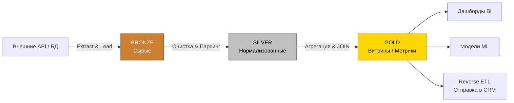

# 🔄 Архитектура и обработка данных: ETL / ELT в SaaS

Современные аналитические и data-driven продукты не могут работать напрямую с «сырыми» базами данных (PostgreSQL, MongoDB) или внешними API. Сырые данные подвержены мутациям, они не нормализованы, содержат дубликаты и не оптимизированы для быстрых аналитических запросов (OLAP).

Для решения этой проблемы используется процесс **конвейеризации данных (Data Pipelining)**, построенный на базе парадигмы ETL или ELT.

---

## 📚 Основные понятия: ETL против ELT

Любой процесс обработки данных строится на трех китах:
1. **E (Extract / Извлечение):** Забор данных из систем-источников (CRM, ERP, биллинги, веб-аналитика, транзакционные БД).
2. **T (Transform / Трансформация):** Очистка, фильтрация, объединение (JOIN), расчет метрик и приведение к единому формату.
3. **L (Load / Загрузка):** Запись данных в конечное хранилище (Data Warehouse / Data Lake).

### Разница подходов
*   **Традиционный ETL (Extract ➡️ Transform ➡️ Load):** Данные извлекаются, очищаются и трансформируются на промежуточном сервере, и только потом загружаются в аналитическое хранилище. *Минусы:* тяжело масштабировать, при падении промежуточного сервера ломаются процессы.
*   **Современный ELT (Extract ➡️ Load ➡️ Transform):** Данные извлекаются и **сразу загружаются** в облачное хранилище в сыром виде. Вся трансформация (T) происходит уже внутри мощного хранилища (Snowflake, BigQuery, ClickHouse) с помощью SQL (например, через инструмент `dbt`). **Это стандарт де-факто для современных SaaS-платформ.**

---

## 🏗️ Медальонная архитектура и Поток данных (Data Flow)

Весь жизненный цикл данных от источника до дашборда делится на строгие этапы (слои). Это называется **Медальонной архитектурой** (Bronze ➡️ Silver ➡️ Gold).

### Этап 1: Источники данных (Data Sources)
Данные в SaaS рождаются в разных местах:
*   **Транзакционные БД (OLTP):** PostgreSQL, MySQL (настройки пользователей, тарифы, биллинг).
*   **Событийные потоки (Event Streaming):** Kafka, WebSockets (клики, сессии, логи действий, телеметрия).
*   **Внешние SaaS-интеграции (APIs):** amoCRM, Salesforce, Stripe, рекламные кабинеты.

### Этап 2: Сбор (Ingestion) и Bronze Layer 🥉
Данные "выкачиваются" по расписанию или через вебхуки и складываются в озеро данных (Data Lake).
*   **Суть:** Данные сохраняются "как есть" (часто в виде одной колонки с сырым JSON `jsonb` или сырых CSV-файлов). Никакой бизнес-логики не применяется.
*   **Идемпотентность:** Если загрузка упала посередине, повторный запуск скрипта не должен задвоить данные. В слой всегда пишутся технические колонки: `_loaded_at` (когда скачано) и `_source_id`.
*   ⚠️ **Правило:** Никогда не подключайте графики и алгоритмы напрямую к слою Bronze.

### Этап 3: Очистка и Нормализация (Silver Layer 🥈)
Ядро работы с данными. Здесь сырой JSON парсится в строгие колонки и таблицы.
*   **Типизация:** JSON-строка `"2025-10-12"` конвертируется в строгий тип `TIMESTAMP`.
*   **Дедупликация (Deduplication):** Удаляются дубли (например, если платежный шлюз прислал два одинаковых вебхука из-за лагов сети).
*   **Очистка (Data Cleansing):** 
    *   *Пропуски:* Заполнение `NULL` дефолтными значениями или категорией "Unknown".
    *   *Форматы:* Приведение email к нижнему регистру, телефонов — к международному формату E.164, валют — к единому знаменателю (например, конвертация всех сумм в USD).
*   **Результат:** Чистые, нормализованные таблицы сущностей (Клиенты, Заказы, Платежи).

### Этап 4: Агрегация и Витрины данных (Gold Layer 🥇)
Бизнесу не нужны списки из миллионов сырых транзакций. Ему нужны метрики (Выручка за месяц, Churn Rate, LTV, Когортный анализ).
*   Строятся **Витрины данных (Data Marts)** — таблицы, где данные уже предрассчитаны и сгруппированы.
*   **Star Schema (Звезда):** Данные организуются вокруг центральной Таблицы фактов (`fact_sales`), к которой привязаны Справочники / Измерения (`dim_users`, `dim_products`, `dim_date`).
*   Здесь реализуется бизнес-логика. Именно этот слой гарантирует, что дашборд откроется мгновенно (за 0.1 сек), так как БД не нужно суммировать миллионы строк на лету.

### Этап 5: Активация (Data Consumption)
Данные из слоя Gold используются для извлечения бизнес-ценности:
1. **BI (Business Intelligence):** Визуализация на дашбордах внутри платформы.
2. **Predictive Analytics (ML):** Обучение моделей на предсказание спроса или оттока. Модель учится **только** на чистых Gold/Silver данных, чтобы избежать переобучения на мусоре.
3. **Reverse ETL:** Отправка рассчитанных инсайтов обратно в операционные системы. Например, платформа рассчитала вероятность оттока клиента (95%) и автоматически обновила это поле в карточке клиента в amoCRM, чтобы менеджер срочно ему позвонил.

---

## ⚠️ Специфика и нюансы ETL для SaaS

Разработка аналитики для SaaS-бизнеса имеет критические отличия от внутренних корпоративных DWH:

### 1. Multi-tenant изоляция (Мультитенантность)
В B2B SaaS данные тысяч разных компаний (клиентов) лежат в одной базе данных.
*   **Жесткое правило:** Абсолютно каждая таблица на каждом слое (Bronze, Silver, Gold) **ОБЯЗАНА** содержать колонку `tenant_id` (или `workspace_id`).
*   Все ETL-скрипты, агрегации и `JOIN` должны фильтровать данные по `tenant_id` (`WHERE tenant_id = X`). Утечка данных чужой компании — самая страшная уязвимость в SaaS.

### 2. Обработка удалений (CDC и Soft Deletes)
Когда пользователь удаляет сделку в своей CRM, как обновить аналитику?
*   В аналитическом хранилище не принято делать физические удаления (Hard Delete), так как ломается история.
*   Используется механизм **CDC (Change Data Capture)** или мягкое удаление. Запись помечается флагом `is_deleted = true`. На слое Silver такие записи отфильтровываются и не попадают в расчеты метрик (слой Gold).

### 3. Версионирование справочников (SCD Type 2)
*Проблема:* Менеджер работал в отделе "Продажи", а в июне перешел в "Маркетинг". Как считать его старые майские сделки?
*   Для аналитики нельзя просто обновить отдел в таблице юзеров (иначе все майские сделки перепишутся на Маркетинг).
*   Используется **SCD (Slowly Changing Dimensions)**. При смене отдела создается новая строка-версия менеджера. Появляются колонки `valid_from` и `valid_to`. Старые сделки джойнятся к "старой" версии менеджера, новые — к "новой". Это гарантирует историческую достоверность отчетов.

### 4. Таймзоны (Timezones)
SaaS работает глобально.
*   **Сбор и Хранение:** Все даты на слоях Bronze и Silver сохраняются **строго в UTC** (тип `TIMESTAMPTZ`).
*   **Отображение:** Приведение к локальному часовому поясу клиента происходит **только** на последнем этапе (Gold) при агрегации дневной выручки, либо вообще перекладывается на клиентскую часть интерфейса (браузер).

### А. Оркестрация процессов (Обеспечение Data Flow)
В документе описаны слои, но не описано, кто и как заставляет данные двигаться между ними.

**Что добавить:** Описание принципов запуска пайплайнов. Как запускается переход из Bronze в Silver? Это триггеры в базе данных, cron-задачи или полноценные оркестраторы (Airflow, Dagster, Prefect)? Необходимо зафиксировать правило управления зависимостями: слой Gold обновляется только после успешного обновления слоя Silver.

### Б. Качество данных и Data Contracts (Data Observability)
Сырые данные из внешних API часто ломаются (поменялся формат ответа, отвалился ключ).

**Что добавить:** Этап тестирования данных перед заливкой в слой Silver. Скрипты должны проверять базовые контракты: отсутствие дубликатов по Primary Key, обязательное наличие `tenant_id`, суммы транзакций не могут быть отрицательными. Если тест не пройден — процесс останавливается, чтобы "мусор" не попал в дашборды.
## 🚀 Профессиональные стандарты выдачи результатов и запуска алгоритмов

Для полноценной работы SaaS-платформы с данными необходимо внедрить следующие архитектурные стандарты обработки и выдачи:

### 1. Выдача результатов и UX (Data Consumption)
*   **Interactive Data Discovery (Интерактивная выдача):** Дашборды, построенные на слое Gold, должны поддерживать Self-Service. Клиенту нужны Drill-down (проваливание в детали), динамические фильтры и экспорт сырых агрегатов в Excel/CSV.
*   **Data Freshness Indicators (Индикаторы свежести):** Пользователь должен четко видеть в UI, когда данные обновлялись в последний раз ("Синхронизировано 5 мин назад"). Если алгоритм или ETL-пайплайн задерживается, показываем желтый статус.
*   **Data Lineage (Прослеживаемость данных):** Если пользователь сомневается в цифре на экране, платформа должна уметь "расшифровать" алгоритм ее расчета (из каких таблиц Silver и Bronze она собралась). Это строит абсолютное доверие к SaaS.

### 2. Запуск алгоритмов и Активация данных
*   **Изолированные среды для алгоритмов (Algorithm Sandboxes):** Тяжелые алгоритмы предиктивной аналитики (Python/ML) не должны крутиться на основном сервере API. Их нужно выносить в Serverless-контейнеры с Read-Only доступом к витринам Gold, чтобы не "положить" базу данных.
*   **Reverse ETL (Активация результатов):** Добавление стандарта отправки результатов алгоритмов (например, RFM-сегментов) обратно в рекламные кабинеты или сервисы email-рассылок для создания умных аудиторий.
*   **Cross-tenant Benchmarks (Глобальные алгоритмы):** Правила запуска алгоритмов на анонимизированных агрегатах всех клиентов (с их согласия), чтобы выдавать в интерфейс сравнение: "Ваша маржинальность на 15% выше, чем в среднем по рынку".

## 🛠 Практическое применение (Привязка к стеку)

Поскольку проектирование архитектуры — это лишь первый шаг, важно понимать, как абстрактная медальонная архитектура "приземляется" на реальную инфраструктуру. Если реализовывать это с использованием ИИ-инструментов кодогенерации, четкое разделение логики в базе данных критически важно — ИИ отлично пишет небольшие, изолированные SQL-запросы для каждого слоя.

**Пример реализации на стеке Python + PostgreSQL (Supabase):**

| Слой (Layer) | Инструмент / Место хранения | Практическая реализация |
| :--- | :--- | :--- |
| **Bronze** 🥉 | PostgreSQL (схема `raw_data`) | Скрипт на Python вытягивает данные по API и складывает их "как есть" в поле типа `jsonb`. Таблица имеет колонки: `id`, `tenant_id`, `raw_payload`, `loaded_at`. |
| **Silver** 🥈 | PostgreSQL (схема `analytics`) | SQL-представления (Views) или материализованные представления (Materialized Views), которые "распаковывают" `jsonb`, фильтруют `is_deleted = true` и приводят типы данных. |
| **Gold** 🥇 | PostgreSQL (схема `marts`) | Предрассчитанные таблицы витрин данных. Заполняются по расписанию (например, через `pg_cron` в Supabase). К этим таблицам напрямую обращается frontend (React/Next.js) для отрисовки графиков. |
